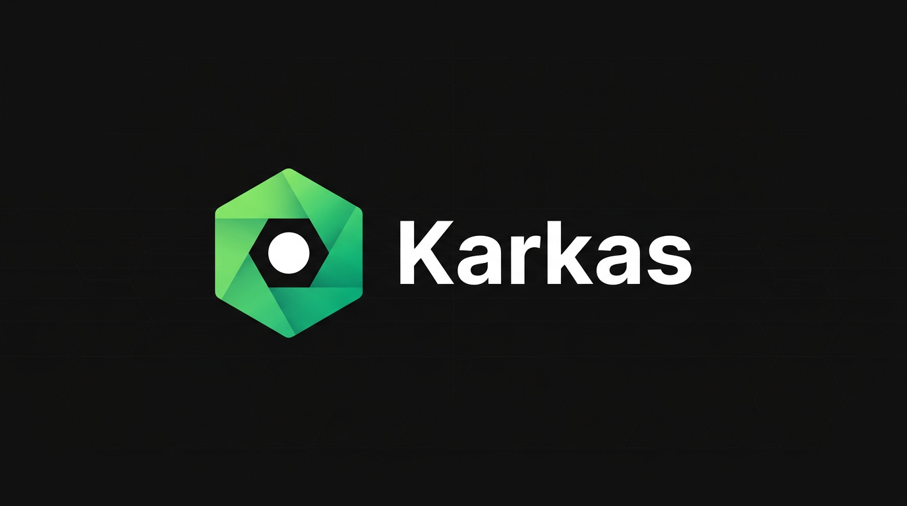

# Karkas



**Karkas** (*Russian: “frame”*) is an interview prep app: a solid frame helps you build something strong. It combines a **study guide**, **timed practice**, and **progress** tracking so you can turn technical knowledge into clear, confident answers. All practice data stays in your browser.

This project was generated with [Angular CLI](https://github.com/angular/angular-cli) 21.1.4.

## Development server

```bash
ng serve
```

Open `http://localhost:4200/`. The app reloads when you change source files.

## Code scaffolding

```bash
ng generate component component-name
```

```bash
ng generate --help
```

## Build

```bash
ng build
```

Artifacts are written to `dist/karkas/browser` (production configuration).

## Unit tests

```bash
ng test
```

Uses the [Vitest](https://vitest.dev/) runner via `@angular/build`.

## GitHub social preview

For the repository card image, upload `docs/karkas-github-hero.png` under **Settings → General → Social preview**.

## More

[Angular CLI reference](https://angular.dev/tools/cli)
